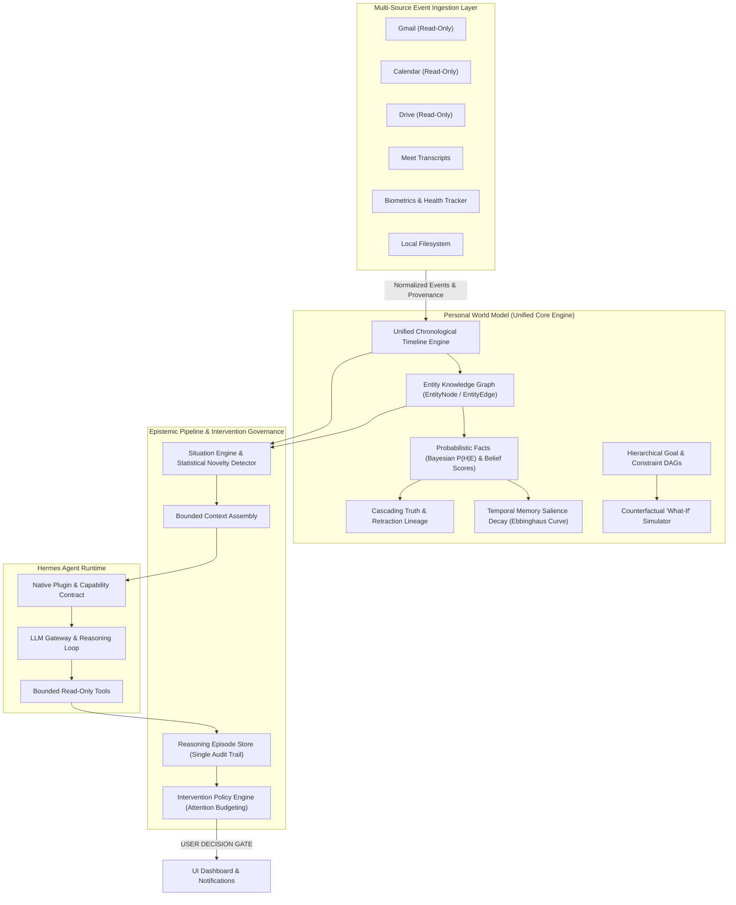

# Personal Intelligence (on Hermes Agent Runtime)

A local-first, privacy-preserving **Personal Intelligence system** designed as a unified situational reasoning and state engine running on top of the **Hermes Agent runtime**.

---

## 1. Core Philosophy: Unified Intelligence (Not Domain Agents)

The Personal Intelligence system is **NOT** a collection of siloed domain agents (e.g., *Finance Agent*, *Health Agent*, *Calendar Agent*, *Travel Agent*).

Real personal situations routinely cross arbitrary boundaries. A delay in travel impacts sleep, which influences morning workout goals, which shifts work calendar commitments, which alters family obligations. Siloing these into disparate agents leads to fragmented context, conflicting interventions, and conversational chaos.

Instead, **Personal Intelligence** operates as a single, holistic intelligence layer that:
- Observes arbitrary personal events across any sphere of life.
- Maintains a continuous, unified timeline and dynamic state representation.
- Assesses emerging situations across multiple overlapping goals simultaneously.
- Detects novelty and routine deviations through transparent heuristics.
- Delegates bounded investigations, external research, and complex tool execution to the **Hermes Agent** runtime.
- Governs user attention through an explicit intervention policy and learns what interventions work over time.

```
┌─────────────────────────────────────────────────────────────────────────────────┐
│                           Personal Intelligence Engine                          │
│                                                                                 │
│  ┌──────────────┐   ┌──────────────┐   ┌──────────────┐   ┌──────────────────┐  │
│  │ Event Model  │──▶│  State and   │──▶│  Situations  │──▶│ Context Builder  │  │
│  │ (Arbitrary)  │   │   Timeline   │   │   & Graph    │   │ (Bundled Frames) │  │
│  └──────────────┘   └──────────────┘   └──────────────┘   └────────┬─────────┘  │
│         │                  │                  │                    │            │
│         ▼                  ▼                  ▼                    ▼            │
│  ┌──────────────┐   ┌──────────────┐   ┌──────────────┐   ┌──────────────────┐  │
│  │   Pattern    │   │  Intervention│   │  Reasoning   │   │   Hermes Bridge  │  │
│  │   Learning   │   │ Policy/Budget│   │   Episodes   │   │  (Plugin/Client) │  │
│  └──────────────┘   └──────────────┘   └──────────────┘   └────────┬─────────┘  │
└────────────────────────────────────────────────────────────────────┼────────────┘
                                                                     │ Invokes /
                                                                     │ Hooks
                                                                     ▼
┌─────────────────────────────────────────────────────────────────────────────────┐
│                           Hermes Agent Runtime                                  │
│                                                                                 │
│   • Persistent Agent Loop         • Web Search & Browser (Headless/Interactive) │
│   • Tool Execution Engine         • Skills System (agentskills.io)              │
│   • Cron Task Scheduler           • Layered Memory (FTS5 / Vector)              │
│   • Bounded Actions               • LLM Invocation & Gateway                    │
└─────────────────────────────────────────────────────────────────────────────────┘
```

### Complete System Architecture Diagram:



---

## 1.1 Canonical Epistemic & Action Model

Personal Intelligence enforces a strict, transparent epistemic and action pipeline:

```
OBSERVATION
    ↓
INFERENCE
    ↓
PREDICTION
    ↓
RECOMMENDATION
    ↓
USER DECISION
    ↓
ACTION
```

### Core Architecture & Guarantees:
1. **Zero Autonomous External Actions (V1)**: Personal Intelligence and Hermes do NOT execute autonomous external write operations or side effects (no sending emails, modifying calendar events, modifying Drive files, or executing destructive scripts).
2. **Explicit User Decision Gate**: Recommendations formulated during reasoning cycles are presented to the user. Moving from `RECOMMENDATION` to `ACTION` strictly requires explicit user approval (`USER DECISION`).
3. **No Automatic Action Implication**: There is zero implication of `RECOMMENDATION -> automatic ACTION`.
4. **Presentation-Only Policy Routing**: `InterventionPolicyEngine` decides strictly *how and when* to present recommendations to the user (`INTERRUPT`, `BRIEFING`, `DEFER`, `SUPPRESS`, `DISCARD`). It does NOT trigger external actions.
5. **Future Action Authorization**: Any future external action execution capability must reside behind explicit user authorization gates.

---

## 2. Division of Responsibilities

To maintain clean separation of concerns and avoid forking or polluting Hermes core, responsibilities are strictly divided:

### Personal Intelligence Owns
1. **Event Model**: Generic, schema-flexible ingestion of arbitrary personal events.
2. **State & Timeline**: Unified snapshot of user availability, cognitive load, tracked entities, and chronological intervals.
3. **Goals & Intentions**: Active user goals, priorities, standing constraints, and deadlines across all life dimensions.
4. **Situations & Novelty Detection**: Multi-event aggregation, cross-goal impact analysis, and deviation from baseline routines without heavy ML.
5. **Context Construction**: Dynamic assembly of concise situational packets and investigation prompts for Hermes.
6. **Pattern Learning**: Statistical and frequency-based routine learning (cadences, typical time windows, habits).
7. **Intervention Policy**: Interruption budget, delivery mode selection (`silent_log`, `digest`, `notification`, `urgent_interrupt`), and tracking user feedback to learn what interventions work.
8. **Reasoning Episodes & History**: Preserving complete records of triggers, context snapshots, Hermes executions, policy choices, and final outcomes.

### Hermes Agent Owns
1. **Reasoning Runtime**: Executing multi-turn reasoning loops, tool coordination, and agentic workflows.
2. **Tool Execution**: Safe execution of local shell, python scripts, filesystem, and external APIs.
3. **Browser & Search**: Live web navigation, search query refinement, and external data retrieval.
4. **External Investigation**: Deep research into external events, flights, documentation, schedules, or pricing.
5. **Complex Synthesis**: Language generation, document distillation, and structured extraction.
6. **Bounded Actions**: Safely executing bounded tasks permitted by the user and policy hooks.

---

## 3. Subsystem Architecture

### 3.1 Event Ingestion (`core/events`)
- Ingests domain-agnostic `Event` instances with timestamp, category, structured payload, metadata, and tags.
- Buffers events in an `EventBuffer` prior to timeline consolidation.

### 3.2 State & Timeline (`core/state`, `core/timeline`)
- `UserState`: Dynamic user focus, cognitive load, location, and activity.
- `StateSnapshot`: Point-in-time coherent snapshot of user and entity states.
- `TimelineEntry` & `TimelineInterval`: Continuous chronological representation of transitions, milestones, and intervals.

### 3.3 Goals & Situations (`core/goals`, `core/situations`)
- `Goal`: Multi-domain objectives with constraints (deadlines, budgets, resource limits).
- `SituationFrame`: Synthesizes multiple events and active goals into a coherent frame when emerging opportunities, risks, or conflicts occur.

### 3.4 Novelty & Divergence Detection (`core/novelty`)
- Evaluates `NoveltyScore` (0.0 to 1.0) using lightweight statistical and heuristic baselines (frequency histograms, routine deviations) rather than heavy neural networks.

### 3.5 Context Construction (`core/context`)
- `ContextBuilder` transforms situation frames, active state snapshots, and goals into structured `HermesInvestigationContext` prompts.

### 3.6 Pattern Learning (`core/patterns`)
- `LearnedPattern`: Discovers recurring cadences (daily, weekly, weekday, event-triggered) from timeline history via local compaction routines.

### 3.7 Intervention Policy (`core/policy`)
- `InterruptionBudget`: Enforces daily interruption quotas, respects focus mode, and guards quiet hours.
- `InterventionDecision`: Determines delivery mode and records user feedback (`accepted`, `ignored`, `rejected`, `helpful`, `annoying`) to tune future interventions.

### 3.8 Reasoning Episodes & Outcome Audit (`core/episodes`)
- `ReasoningEpisode`: Complete audit log linking trigger events, Hermes investigation outputs, policy decisions, and verified outcomes.

---

## 4. Hermes Runtime Integration Architecture

Personal Intelligence integrates with Hermes using official extension points **without modifying Hermes core**:

```
personal_intelligence/hermes_bridge/
├── capabilities.py         # Capability-connection contract, diagnostic models, & HermesCapabilityInspector
├── client.py               # Native runtime bridge (in-process Hermes Agent runtime execution)
├── commands.py             # Slash command dispatch (/pi what_matters, /pi test_sources, /pi ask, etc.)
├── cron/
│   └── schedules.yaml      # Recurring cron task definitions (periodic sweeps)
├── plugin/                 # ~/.hermes/plugins/personal_intelligence
│   ├── plugin.yaml         # Plugin manifest
│   ├── __init__.py         # register(ctx) entrypoint
│   ├── schemas.py          # Tool definitions visible to Hermes LLM
│   ├── tools.py            # Query and outcome handlers
│   └── hooks.py            # pre_tool_call and post_tool_call lifecycle hooks
└── skills/
    └── personal_investigation/
        └── SKILL.md        # agentskills.io standard investigation procedure
```

### 4.1 Strict Hermes Capability-Connection Contract

Personal Intelligence enforces a strict, typed capability-connection contract (`hermes_bridge/capabilities.py`) to monitor and report runtime readiness without handling private credentials or OAuth tokens:

#### 1. Lifecycle Connection Statuses (`HermesConnectionStatus`)
- **`disconnected`**: No host Hermes agent runtime context is attached to the process.
- **`connecting`**: Bridge is actively negotiating or establishing the host runtime session.
- **`connected`**: Host Hermes runtime context is active with authenticated tools.
- **`unavailable`**: Host Hermes daemon or required external tools are offline.
- **`unauthenticated`**: Host Hermes context is present, but external account credentials (e.g. Google Workspace) are not logged in.
- **`error`**: Diagnostic probe captured an unhandled failure during capability inspection.
- **`demo`**: Operating in deterministic synthetic mode with mock observations for offline demonstration.

#### 2. Monitored Capabilities (7 Core Domains)
| Capability | Default Hermes Tool | Auth State | Read-Only | Safe Diagnostics |
| :--- | :--- | :--- | :--- | :--- |
| **`gmail`** | `gmail_search` | Hermes Owned | Strictly Enforced | Safe metadata & health check |
| **`calendar`** | `calendar_list_events` | Hermes Owned | Strictly Enforced | Active event range status |
| **`drive`** | `drive_get_document` | Hermes Owned | Strictly Enforced | Modification timestamp verification |
| **`meet`** | `meet_list_recent_meetings` | Hermes Owned | Strictly Enforced | Transcript summary availability |
| **`filesystem`** | `fs_read` | Local / Hermes | Strictly Enforced | Sandbox directory root verification |
| **`web`** | `web_search` | Hermes Owned | Strictly Enforced | Safe query engine readiness |
| **`reasoning`** | `llm_reasoning` | Native Host LLM | Strictly Enforced | Model context & token bounds |

#### 3. Strict Zero-OAuth & Credential Boundary
- **Zero OAuth Handling**: Personal Intelligence never stores, creates, requests, or refreshes Google OAuth tokens or client secrets.
- **Exclusive Hermes Tool Ownership**: Authentication, token lifecycles, and direct API communications are managed entirely by Hermes.
- **Safe Diagnostic Probing**: Diagnostic calls (`/pi test_sources`, `GET /api/pi/sources`) inspect only tool availability and capability health without dumping email bodies or personal payloads.

### Hermes Extension Mechanisms
1. **Plugin System (`plugin/`)**:
   - Manifest `plugin.yaml` registers the plugin with Hermes.
   - `register(ctx)` exposes custom tools (`query_personal_timeline`, `query_personal_state`, `query_personal_goals`, `record_reasoning_outcome`) to the Hermes agent runtime.
2. **Lifecycle Hooks (`hooks.py`)**:
   - `pre_tool_call`: Validates bounded action policies and safety constraints before Hermes executes tools.
   - `post_tool_call`: Captures execution metrics and logs telemetry to active reasoning episodes.
3. **Skills (`skills/`)**:
   - Standardized `SKILL.md` documents conform to the `agentskills.io` standard, providing step-by-step procedures for Hermes when conducting personal investigations.
4. **Cron Scheduler (`cron/schedules.yaml`)**:
   - Leverages Hermes's natural language and cron scheduler for recurring background tasks:
     - Hourly situation and novelty sweeps (`no-agent` mode).
     - Daily pattern compaction (`no-agent` mode).
     - Morning situation briefing preparation (`agent` mode).
5. **Memory Synergy**:
   - Hermes's layered memory (`MEMORY.md`, `USER.md`, SQLite FTS5) is augmented by Personal Intelligence's structured episodic store and timeline.
6. **Invocation Interface (`client.py`)**:
   - Supports invoking Hermes via CLI (`hermes chat -q`), embedded Python runtime (`run_agent.AIAgent`), or Gateway REST API (`http://localhost:8642/v1`).

---

## 5. Zero-Bloat Architectural Guarantees

This system strictly avoids unnecessary complexity and cloud dependencies:

| Excluded Component | Reason for Exclusion / Alternative Used |
| :--- | :--- |
| **Neo4j / Graph Databases** | Replaced by relational entity schemas and index-backed adjacency in local SQLite. Zero JVM or graph server overhead. |
| **Graphiti** | Avoids external graph maintenance layers; state is maintained as coherent point-in-time snapshots in SQLite. |
| **Vector Databases** | Full-text search (SQLite FTS5), timeline indexing, and heuristic matching provide deterministic, low-memory retrieval without vector embeddings. |
| **Complex ML Pipelines** | Avoids heavy PyTorch/TensorFlow runtimes; pattern learning uses lightweight statistical histograms and frequency rules. |
| **Causal Inference Engines** | Avoids heavy causal DAG frameworks; outcome feedback is tracked via direct policy decision audit records. |
| **Domain-Specific Agents** | Replaced by a single, unified cross-domain situational reasoning and state engine. |
| **External Connectors** | Kept clean and decoupled; ingestion accepts generic structured event payloads. |

---

## 6. Local-First SQLite Storage

All persistence is local-first, private, and contained within a single SQLite database (`~/.personal_intelligence/personal_intelligence.db`).

Core Tables:
- `event_log`: Append-only table storing all generic personal events with unique `event_hash` constraint.
- `timeline_entries`: Chronological entries and intervals.
- `state_snapshots`: Coherent user and entity state records.
- `goals`: User objectives, priorities, and constraints.
- `situations`: Multi-event situational frames.
- `novelty_scores`: Novelty assessments and deviation explanations.
- `learned_patterns`: Learned routines and behavioral cadences.
- `intervention_decisions`: Policy actions, delivery modes, and user feedback.
- `reasoning_episodes`: Full audit history of reasoning cycles and Hermes executions.

---

## 7. Project Structure

```
Personal Intelligence/
├── README.md                                 # Architecture specification (this file)
├── pyproject.toml                            # Package configuration and dependencies
├── personal_intelligence/                    # Main package
│   ├── __init__.py
│   ├── core/                                 # PI Core Subsystems
│   │   ├── __init__.py
│   │   ├── events/                           # Event model, store & buffer
│   │   │   ├── __init__.py
│   │   │   ├── buffer.py
│   │   │   ├── exceptions.py
│   │   │   ├── models.py
│   │   │   └── store.py
│   │   ├── state/                            # Personal state representation & engine
│   │   │   ├── __init__.py
│   │   │   ├── engine.py
│   │   │   └── models.py
│   │   ├── timeline/                         # Timeline queries & deterministic summaries
│   │   │   ├── __init__.py
│   │   │   ├── engine.py
│   │   │   └── models.py
│   │   ├── goals/                            # Goals model & store
│   │   │   ├── __init__.py
│   │   │   ├── models.py
│   │   │   └── store.py
│   │   ├── situations/                       # Situation model, engine & store
│   │   │   ├── __init__.py
│   │   │   ├── engine.py
│   │   │   ├── models.py
│   │   │   └── store.py
│   │   ├── novelty/                          # Statistical novelty detection
│   │   │   ├── __init__.py
│   │   │   ├── detector.py
│   │   │   └── models.py
│   │   ├── context/                          # Bounded context construction for Hermes
│   │   │   ├── __init__.py
│   │   │   ├── builder.py
│   │   │   └── models.py
│   │   ├── patterns/                         # Recurring pattern & routine learning
│   │   │   ├── __init__.py
│   │   │   └── models.py
│   │   ├── policy/                           # Intervention policy & user interruption budget
│   │   │   ├── __init__.py
│   │   │   └── models.py
│   │   └── episodes/                         # Reasoning episodes & outcome audit history
│   │       ├── __init__.py
│   │       └── models.py
│   ├── api/                                  # Local HTTP Event Ingestion API
│   │   ├── __init__.py
│   │   ├── ingestion.py                      # Event validation and normalization service
│   │   └── server.py                         # Local HTTP server (ThreadingHTTPServer)
│   ├── storage/                              # Local-first SQLite persistence
│   │   ├── __init__.py
│   │   ├── db.py
│   │   └── schema.sql
│   └── hermes_bridge/                        # Hermes runtime integration
│       ├── __init__.py
│       ├── client.py                         # Programmatic Hermes client
│       ├── reasoning.py                      # Hermes situational reasoning workflow & synthesis
│       ├── cron/                             # Hermes cron schedule configurations
│       │   └── schedules.yaml
│       ├── plugin/                           # Hermes plugin extension
│       │   ├── __init__.py
│       │   ├── hooks.py
│       │   ├── plugin.yaml
│       │   ├── schemas.py
│       │   └── tools.py
│       └── skills/                           # Hermes investigation skills
│           └── personal_investigation/
│               └── SKILL.md
├── scripts/
│   ├── verify_ingestion_live.py              # Live event ingestion verification script
│   └── verify_timeline_live.py               # Live timeline engine verification script
└── tests/                                    # Unit & Integration test suites
    ├── __init__.py
    ├── test_context_builder.py               # Bounded context builder unit tests
    ├── test_episode_store.py                 # Unified reasoning episodes store unit tests
    ├── test_event_api.py                     # API and HTTP integration tests
    ├── test_event_store.py                   # Event store unit tests
    ├── test_goals.py                         # Goals model and store unit tests
    ├── test_hermes_plugin.py                 # Hermes plugin and tool unit tests
    ├── test_intervention_policy.py           # Categorical intervention policy unit tests
    ├── test_learning_engine.py               # Personal learning engine & pattern tracking tests
    ├── test_novelty_detector.py              # Statistical novelty detection tests
    ├── test_reasoning_workflow.py            # Hermes reasoning workflow unit tests
    ├── test_response_outcome_tracking.py     # User response & outcome tracking unit tests
    ├── test_situation_engine.py              # Situation engine candidate generator tests
    ├── test_situations.py                    # Situation model and store unit tests
    ├── test_skeleton_import.py               # Package skeleton tests
    ├── test_state_representation.py          # State representation unit tests
    └── test_timeline_engine.py               # Timeline engine unit tests
```

---

## 8. Event Ingestion API

The system provides a lightweight, local-first HTTP endpoint for domain-agnostic event ingestion.

### Starting the Server
```bash
python -m personal_intelligence.api.server
```

---

## 9. Timeline Engine

The `TimelineEngine` queries the `event_log` source of truth to produce chronologically guaranteed `Timeline` views.

### Query APIs
- `engine.get_last_n_minutes(minutes, reference_time=...)`
- `engine.get_last_n_hours(hours, reference_time=...)`
- `engine.get_today(reference_time=..., tz=...)`
- `engine.get_yesterday(reference_time=..., tz=...)`
- `engine.get_last_n_days(days, reference_time=...)`
- `engine.get_time_range(start_time, end_time, subject_id=..., event_types=..., limit=...)`
- `engine.get_around_event(event_id, count_before=5, count_after=5, window_before=..., window_after=...)`
- `engine.get_for_subject(subject_id, ...)`
- `engine.get_for_type(event_type, ...)`

---

## 10. Personal Goals Model

User goals are represented as contextual data descriptors (intentions, constraints) for reasoning, rather than automated workflows, task graphs, or autonomous planners.

### `GoalStore` APIs
- `store.create_goal(name, description=..., priority=..., status=...)`
- `store.update_goal(goal_id, name=..., description=..., priority=..., status=...)`
- `store.get_goal(goal_id)`
- `store.list_active_goals()`
- `store.archive_goal(goal_id)`
- `store.list_all_goals(status=...)`

---

## 11. Situation Model & Store

A **Situation** represents an integrated, assessable context frame spanning multiple events, active goals, and evidence across arbitrary life dimensions. It is **NOT** an agent.

### Situation Attributes
- `id`: Unique identifier
- `type`: Arbitrary situation type (e.g. `unusual_state`, `schedule_conflict`, `travel_risk`, `prolonged_activity`)
- `status`: `open`, `investigating`, `closed`, `expired`
- `created_at` & `updated_at`: UTC timestamps
- `last_evaluated_at`: Optional timestamp when reasoning last evaluated this frame
- `priority`: `critical`, `high`, `medium`, `low`, `informational`
- `novelty`: Score in `[0.0, 1.0]`
- `context`: Arbitrary structured context dictionary
- `evidence`: List of supporting event IDs, sensor readings, or facts
- `related_goals`: List of impacted goal IDs
- `expires_at`: Optional expiration timestamp

### `SituationStore` APIs
- `store.create(type, priority=..., novelty=..., context=..., evidence=..., related_goals=..., expires_at=..., status=...)`
- `store.update(situation_id, type=..., status=..., priority=..., novelty=..., context=..., evidence=..., related_goals=..., expires_at=..., last_evaluated_at=...)`
- `store.get(situation_id)`
- `store.list_open(priority=...)`
- `store.close(situation_id, resolution_notes=...)`
- `store.expire(as_of_time=...)`: Sweeps past-expiration open situations and marks them as `expired`
- `store.find_similar(situation_type=..., related_goals=..., active_only=...)`: Deterministic matching across types and shared goals

### `SituationEngine` (Candidate Generators)
The `SituationEngine` consumes `StateRepresentation`, `Timeline`, active `Goal`s, and `NoveltyResult` to generate candidate `Situation`s with explicit evidence tracking.

#### Generic Deterministic Candidate Generators:
1. `unusual_state`: Fires on statistical novelty divergence in any dimension; acts as a generic fallback for arbitrary/unfamiliar novel combinations without domain rules.
2. `prolonged_activity`: Continuous activity duration exceeds threshold ($\ge 120$ mins).
3. `schedule_conflict`: Overlapping schedule or calendar commitments in timeline.
4. `possible_goal_risk`: Critical/high goal pressures combined with elevated divergence.
5. `routine_deviation`: Routine deviation score exceeds threshold ($\ge 0.50$).
6. `potential_deadline_risk`: Imminent task or milestone deadlines approaching in timeline.

#### `SituationEvaluation` Output
- `candidate_situations[]`: List of generated candidate `Situation` objects
- `ignored_signals[]`: Tracked signals that were within nominal thresholds
- `evidence[]`: Consolidated evidence event IDs and state feature sources

---

## 12. Personal State Representation Layer

The **Personal State Representation** layer computes a compact, deterministic snapshot of current user state across multiple generic dimensions without any LLMs, vector embeddings, or machine learning.

### Supported Generic Dimensions
1. `time_of_day`: Fractional hour and temporal day bucket (`morning`, `afternoon`, `evening`, `night`).
2. `current_location`: Derived from the most recent location event or payload.
3. `current_activity`: Derived from the most recent activity/interaction event.
4. `event_density`: Event arrival rate (events per minute) over the last 60 minutes.
5. `recent_activity_duration`: Continuous duration (minutes) of the active engagement episode.
6. `routine_deviation`: Deterministic baseline divergence score in `[0.0, 1.0]`.
7. `goal_pressure`: Weighted pressure metric computed across active goal priorities.

### StateFeature Model
Every feature dimension explicitly tracks:
- `name`: Feature dimension identifier
- `value`: Feature value (scalar or structured dict)
- `source`: Provenance source identifier (e.g. `clock`, `event:evt-1`, `timeline_last_60m`, `goal_store`)
- `timestamp`: UTC datetime of the observation/computation
- `confidence`: Confidence score in `[0.0, 1.0]`
- `metadata`: Optional supplemental metadata

### `StateEngine` APIs
- `engine.compute_current_state(reference_time=..., subject_id=...) -> StateRepresentation`
- `engine.register_extractor(name, extractor_fn)`: Seamless custom dimension extensibility

---

## 13. V1 Statistical Novelty Detection

Purely mathematical, deterministic divergence analysis comparing current state dimensions against historical baseline distributions without ML, neural networks, or vector embeddings.

### Numerical Features: Z-Score Formulation
$$z = \frac{\text{current} - \mu_{\text{historical}}}{\sigma_{\text{historical}}}$$

- $|z| < 1.0 \rightarrow$ `normal`
- $1.0 \le |z| < 2.0 \rightarrow$ `unusual`
- $|z| \ge 2.0 \rightarrow$ `highly_unusual`
- Zero variance ($\sigma = 0$): Exact match $\rightarrow$ `normal`, deviation $\rightarrow$ `highly_unusual`.

### Categorical Features: Empirical Frequency Analysis
$$p = \frac{\text{count}(\text{current\_val})}{\text{total\_history}}$$

- $p = 0.0$ (unseen value) or $p < 0.10 \rightarrow$ `unusual` / `highly_unusual`
- $p \ge 0.10 \rightarrow$ `normal`

### Overall Classification Aggregation
- If any dimension is `highly_unusual` $\rightarrow$ `HIGHLY_UNUSUAL`
- Else if any dimension is `unusual` $\rightarrow$ `SLIGHTLY_UNUSUAL`
- Else $\rightarrow$ `NORMAL`

### Limitations of V1 Statistical Approach
1. **Univariate Independence**: Dimensions are evaluated independently; cannot detect multivariate correlated anomalies (e.g. elevated heart rate during sleep vs during exercise).
2. **Unimodal Gaussian Assumption**: Assumes unimodal normal distributions, which can distort bimodal behaviors (e.g. alternating between home and office).
3. **Equal Temporal Horizon**: Averages past points uniformly without exponential recency weighting.
4. **Novelty $\neq$ Importance**: Rarity does not imply urgency or user importance; novel states do not directly trigger notifications without situational reasoning.

---

## 14. Personal Intelligence Context Builder

The **Context Builder** transforms a `Situation` into a bounded, relevance-filtered reasoning context for Hermes. It strictly avoids dumping raw event histories while preserving complete provenance on all context items.

### Context Dimensions Retained
1. `current_state`: State features with provenance (`state_key`, `value`, `source`, `confidence`).
2. `relevant_recent_timeline`: Proximate events ($\le 120$ mins) and events cited in evidence.
3. `relevant_historical_events`: Older events matching situation event types/subject/baseline references.
4. `active_goals`: Goals prioritized by `related_goals` and priority level (`critical` > `high` > `medium`).
5. `known_patterns`: Recurring habits/routines matching current activity or temporal cadence.
6. `emerging_hypotheses`: Deterministic candidate explanations generated from situation context & evidence.
7. `similar_past_situations`: Prior situations sharing type or related goals from `SituationStore`.
8. `recent_reasoning_episodes`: Historical decision and investigation records.
9. `uncertainties`: Low-confidence signals ($< 0.80$), missing data, and ambiguities for Hermes to investigate.

### Configurable Limits & Provenance
- `max_recent_events`, `max_historical_events`, `max_goals`, `max_patterns`, `max_similar_situations`, `max_recent_episodes`.
- Output is 100% deterministic, JSON-serializable (`to_json()`), and formatted for prompt assembly (`to_prompt_string()`).

---

## 15. Hermes Plugin & Skill Integration

Personal Intelligence integrates with Hermes Agent via its non-invasive plugin architecture without forking or modifying Hermes core.

### Exposed Plugin Tools
1. `get_current_personal_state(subject_id=...)`: Read current state features with provenance.
2. `get_personal_timeline(last_n_minutes=..., last_n_hours=..., event_type=..., ...)`: Query bounded chronological events.
3. `get_active_goals(status=...)`: List active user goals from `GoalStore`.
4. `get_situation(situation_id)`: Retrieve specific situation context and evidence.
5. `get_reasoning_context(situation_id, objective=...)`: Construct structured bounded context for Hermes.
6. `store_reasoning_episode(...)`: Record reasoning investigation outcomes into audit history with explicit epistemic categories (`observations`, `inferences`, `predictions`, `recommendations`, `uncertainties_identified`, `evidence_references`).

### Epistemic Rules for Hermes (`SKILL.md`)
- Hermes is the **reasoning runtime**, receiving bounded context.
- Hermes must strictly categorize outputs into: **observations**, **inferences**, **predictions**, **recommendations**, and **actions**.
- **No invented facts**: Zero ungrounded personal/biometric assertions.
- **Explicit uncertainty identification**: Itemize all low-confidence signals ($< 0.80$) and gaps.
- **Evidence references**: Cite exact `event_id`, `state_key`, `goal_id`, or URLs.
- **No interruption decisions**: Interruption policy is owned exclusively by Personal Intelligence.

---

## 16. Hermes Situational Reasoning Workflow

The **Hermes Reasoning Workflow** orchestrates bounded context construction, prompt formatting, Hermes LLM invocation, structured categorical synthesis extraction, and audit persistence into SQLite.

### 7 Core Reasoning Questions Answered
1. **What appears to be happening?** (`what_is_happening`)
2. **What evidence supports this?** (`evidence_summary[]`)
3. **What is inferred rather than observed?** (`inferences[]`)
4. **What might happen next?** (`predictions[]`)
5. **Is there a useful recommendation?** (`recommendations[]`)
6. **What is uncertain?** (`uncertainties[]`)
7. **Does this require follow-up?** (`requires_follow_up`)

### Categorical Assessment Ratings (No Probabilities)
- **`urgency`**: `low` | `medium` | `high` | `critical`
- **`actionability`**: `low` | `medium` | `high`
- **`relevance`**: `low` | `medium` | `high`
- **`evidence_strength`**: `weak` | `moderate` | `strong`

### Hardened Validation & Retry Pipeline
- **Strict Schema Validation**: Verifies root dictionary, non-empty `what_is_happening`, list types on evidence/inferences/predictions/recommendations/uncertainties, boolean `requires_follow_up`, and discrete string enums.
- **Targeted Retry Loop**: If validation fails, Hermes is re-prompted with specific field failure messages (up to 2 retries).
- **Zero Discard Policy**: On permanent failure, a `ReasoningEpisode` is persisted with `status = unparseable`, capturing the raw response, validation errors, task, and situation ID.
- **Safe Fallback**: Returns a safe `StructuredReasoningSynthesis` fallback without crashing callers.

---

## 17. Unified Reasoning Episodes Store & Longitudinal Outcome Tracking

The **Reasoning Episodes Store** captures the full end-to-end reasoning lifecycle in **ONE single SQLite table** without auxiliary recommendation or reasoning tables:

$$\text{Situation} \rightarrow \text{Reasoning} \rightarrow \text{Recommendation} \rightarrow \text{Intervention Decision} \rightarrow \text{User Response} \rightarrow \text{Outcome}$$

### Recommendation Result States (`RecommendationResult`)
Every recommendation interaction and outcome is categorized into standard states:
- `ACCEPTED`: User explicitly accepted or acted on the recommendation.
- `DISMISSED`: User dismissed or rejected the prompt.
- `IGNORED`: User neither interacted nor acknowledged the notification.
- `DEFERRED`: Recommendation deferred to a later time.
- `COMPLETED`: Empirical verification confirms recommendation goal was achieved.
- `PARTIALLY_COMPLETED`: Partial progress observed.
- `UNKNOWN`: Insufficient evidence to evaluate outcome.

### Python APIs (`EpisodeStore`)
- `create_episode(...) -> ReasoningEpisode`
- `record_user_response(episode_id, response, feedback_notes=..., timestamp=..., metadata=...) -> Optional[ReasoningEpisode]`
- `record_outcome(episode_id, outcome_status, evaluation_notes=..., success=..., observed_at=..., impact_metrics=..., evidence_event_ids=...) -> Optional[ReasoningEpisode]`
- `update_response(episode_id, user_response, status=...) -> Optional[ReasoningEpisode]`
- `update_outcome(episode_id, outcome, status=...) -> Optional[ReasoningEpisode]`
- `get_episode(episode_id) -> Optional[ReasoningEpisode]`
- `list_recent(limit=10) -> List[ReasoningEpisode]`
- `list_by_situation(situation_id, limit=50) -> List[ReasoningEpisode]`

---

## 18. Personal Intelligence Intervention Policy

The **Intervention Policy Engine** provides pure categorical, deterministic decision logic governing when to reach out to the user without numerical interruption scores or fake confidence probabilities.

### Input Dimensions
- **`urgency`**: `low` | `medium` | `high` | `critical`
- **`actionability`**: `low` | `medium` | `high`
- **`evidence_strength`**: `weak` | `moderate` | `strong`
- **`user_context`**: `available` | `busy` | `deep_work` | `meeting` | `driving` | `sleeping` | `do_not_disturb`
- **`already_notified`**: `true` | `false`
- **`recently_dismissed`**: `true` | `false`

### Deterministic Decision Rules
- **`CRITICAL` Urgency** $\rightarrow$ `INTERRUPT` (overrides user context and hard suppression).
- **`HIGH` Urgency + `HIGH` Actionability + `STRONG` Evidence**:
  - User `available` $\rightarrow$ `INTERRUPT`
  - User `busy`, in `meeting`, or `deep_work` $\rightarrow$ `DEFER`
  - User `driving`, `sleeping`, or `do_not_disturb` $\rightarrow$ `SUPPRESS`
- **`MEDIUM` Urgency**:
  - `available` + actionable $\rightarrow$ `BRIEFING`
  - `busy` / `meeting` / `deep_work` $\rightarrow$ `DEFER`
  - `driving` / `sleeping` / `do_not_disturb` $\rightarrow$ `SUPPRESS`
  - Low actionability $\rightarrow$ `DISCARD`
- **`LOW` Urgency** $\rightarrow$ `DISCARD` (silently dropped across all contexts).
- **Hard Suppression Contexts**: `meeting`, `driving`, `sleeping`, `deep_work`, `do_not_disturb` (suppressed/deferred unless `critical`).
- **Fatigue & Repetition**: `already_notified` $\rightarrow$ `DISCARD`, `recently_dismissed` $\rightarrow$ `SUPPRESS`.

### Action Enums Returned (`PolicyAction`)
- `INTERRUPT`: Proactively interrupt the user immediately.
- `BRIEFING`: Queue silently for the upcoming scheduled digest/briefing.
- `DEFER`: Defer until the user transitions out of busy/meeting/deep work.
- `SUPPRESS`: Suppress due to user context (driving, sleeping, DND) or dismissal cooldown.
- `DISCARD`: Silently discard without user notification.

---

## 19. Personal Learning Engine & Non-Causal Pattern Discovery

The **Personal Learning Engine** discovers recurring personal associations and behavioral regularities from reasoning episodes and event history without claiming causation or using causal inference.

### Core Non-Causal Rule
Patterns are stored and formulated strictly as **empirical associations**:
- ✅ *"Low sleep appears associated with shorter workouts."*
- ❌ *"Low sleep causes shorter workouts."*

### 7-Stage Lifecycle Progression (`PatternStatus`)
1. **`OBSERVED`**: Initial observation of a co-occurrence (support count = 1).
2. **`HYPOTHESIS`**: Formulated candidate hypothesis under evaluation (support count $\ge$ 2).
3. **`EMERGING`**: Gaining statistical grounding with minimal contradictions (support count $\ge$ 4, ratio $\ge$ 75%).
4. **`SUPPORTED`**: Well-evidenced regular personal association (support count $\ge$ 7, ratio $\ge$ 80%).
5. **`ACTIVE`**: High-confidence established pattern used for contextual reasoning (support count $\ge$ 10, ratio $\ge$ 85%, recently observed).
6. **`DECAYING`**: Experiencing contradictions (ratio $<$ 75%) or unobserved for $\ge$ 14 days (`decay_after_days`).
7. **`INACTIVE`**: Disproven or retired pattern (contradictions $\ge$ support or unobserved for $\ge$ 45 days).

### Recency Decay & Recovery Rules
- **Temporal Inactivity**: Sweeps with `engine.apply_recency_decay(as_of=...)` demote unreinforced patterns (`ACTIVE` $\rightarrow$ `DECAYING` $\rightarrow$ `INACTIVE`).
- **Contradiction-Driven Demotion**: Rapid contradictions accelerate transition to `DECAYING` and `INACTIVE`.
- **Zero Evidence Deletion**: Historical empirical records in `pattern_evidence` are permanently preserved during decay or deactivation sweeps.
### Intervention Preference Learning (`scan_intervention_preferences`)
The learning engine inspects longitudinal reasoning episodes across user responses (`ACCEPTED`, `DISMISSED`, `IGNORED`, `COMPLETED`), recommendation specificity, timing, urgency, and delivery contexts to formulate candidate interaction preference hypotheses:
- **Recommendation Specificity**: Detects responsiveness to detailed actionable recommendations vs generic reminders (*"User appears more responsive to specific contextual recommendations than generic reminders"*).
- **Delivery Timing**: Detects diurnal responsiveness patterns (*"User appears more responsive to recommendations delivered during morning hours"*).
- **Intervention Urgency**: Discovers response divergence across urgency tiers (*"Recommendations delivered with high urgency appear associated with higher acceptance rates"*).
- **Delivery Context**: Detects contextual sensitivity (*"Recommendations delivered during busy context appear associated with higher dismissal rates"*).
- **Strict Provenance**: Every interaction pattern links supporting `episode_id`s in `PatternEvidence` and metadata without mutating the policy engine prematurely.

### Relational Schema (`patterns` and `pattern_evidence`)
- **`patterns` Table**: Tracks `id`, `description`, `first_seen`, `last_seen`, `support_count`, `contradiction_count`, `evidence_strength`, `status`, and `metadata_json`.
- **`pattern_evidence` Table**: Records individual empirical observations (`SUPPORT` vs `CONTRADICTION`) linked to reasoning episode IDs, event IDs, timestamps, and observational details.

### Python APIs (`LearningEngine` & `PatternStore`)
- `engine.register_candidate_pattern(description, first_seen=..., metadata=...) -> Pattern`
- `engine.record_evidence(pattern_id, observation_type, observed_at=..., episode_id=..., event_ids=..., details=...) -> Tuple[Pattern, PatternEvidence]`
- `engine.apply_recency_decay(as_of=...) -> List[Pattern]`
- `engine.scan_episodes_for_associations(episodes) -> List[Pattern]`
- `engine.scan_intervention_preferences(episodes) -> List[Pattern]`
- `pattern_store.list_patterns(status=..., limit=...) -> List[Pattern]`
- `pattern_store.list_evidence_for_pattern(pattern_id, limit=...) -> List[PatternEvidence]`

---

## 20. Novel Situation Reasoning

When the statistical novelty engine detects unfamiliar personal states differing significantly from historical baselines without predefined heuristic rules:
1. **NOVEL Situation Formulation**: `SituationEngine` / `SituationStore` synthesizes a generic situation frame (`unusual_state` / `novel`) detailing anomalous feature deviations and evidence.
2. **Bounded Reasoning Context**: `ContextBuilder` aggregates 9-dimensional context (state, timeline, active goals, patterns, past episodes, novelty data).
3. **Exploratory Hermes Reasoning**: Hermes is prompted with strict JSON schema constraints asking:
   - `what_appears_unusual`: Specific features/events deviating from baseline.
   - `possible_interpretations`: Potential hypotheses without forced assumptions.
   - `relevant_goals`: Pertinent user goals.
   - `possible_risks`: Downside risks.
   - `possible_opportunities`: Upside opportunities.
   - `what_is_uncertain`: Explicitly missing context or ambiguities.
   - `additional_observation_needed`: Whether timeline observation should continue.
4. **Epistemic Restraint & Insufficient Evidence**:
   - Zero forced explanations or invented facts.
   - If context is sparse, Hermes explicitly returns `"insufficient evidence"`, captured in `insufficient_evidence: True`.
5. **Episode Persistence**: Stored in the unified `reasoning_episodes` table preserving full provenance.
6. **Categorical Intervention Policy Routing**:
   - *Novel $\ne$ Important & Novel $\ne$ Notify*.
   - The deterministic `InterventionPolicyEngine` independently determines whether to `DISCARD`, `SUPPRESS`, `DEFER`, `BRIEFING`, or `INTERRUPT`.

### Pipeline Execution
```python
from personal_intelligence.hermes_bridge.novelty_orchestrator import NoveltyReasoningOrchestrator

orchestrator = NoveltyReasoningOrchestrator()
result = orchestrator.process_novel_state(
    novelty_result=novelty_result,
    current_state=state,
    timeline=timeline,
    goals=goals,
    user_context="available",
)
```

---

## 21. Cross-Domain Context Reasoning

Personal Intelligence operates on a single generic event stream with **zero siloed domain agents** (no HealthAgent, TravelAgent, WorkAgent, etc.). The `ContextBuilder` autonomously determines relevance across completely unrelated domains:

### Cross-Domain Relevance & Diversity Scoring
- **Domain Categorization**: Generic classifiers (`classify_event_domain` & `classify_state_feature_domain`) tag events across high-level domains (`biometrics_health`, `schedule_work`, `mobility_transit`, `location_environment`, `device_activity`, `goals_intentions`).
- **Multi-Domain Relevance**: Scores events using temporal recency, situation evidence matching, active goal domain correlations, and state feature correlations.
- **Starvation Protection**: Multi-domain diversity allocation ensures bursts of high-frequency events (e.g. 50 app clicks) never crowd out critical events from other domains (e.g. sleep duration, calendar meeting, weather alert).
- **Prompt Synthesis**: Renders prominent cross-domain intersection headers and hypotheses for Hermes when $\ge 2$ domains are represented.

### Example Multi-Domain Scenarios Supported
1. **Sleep + Workload + Fitness Goal + Activity**:
   - `biometrics_health` (5.2h sleep) + `schedule_work` (4 upcoming meetings) + `goals_intentions` (Half Marathon tempo run) + `device_activity` (VSCode coding session).
   - Hermes recommendation: Reschedules intense 10-mile run to a 20-minute recovery jog to protect recovery without disrupting afternoon reviews.
2. **Train + Location + Weather + Commute History**:
   - `mobility_transit` (17:45 Amtrak departure) + `location_environment` (18 miles away in suburbs) + `location_environment` (Heavy Rain storm) + `mobility_transit` (Historical 55m commute in rain).
   - Hermes recommendation: Depart 30 minutes earlier to ensure train boarding.

---

## 22. Situation Lifecycle Management

Situations progress through defined lifecycle states, maintain stable identity across re-evaluations, and support automated future re-evaluation scheduling:

### 5 Standard Lifecycle States
- `OPEN`: Newly detected situation frame awaiting initial evaluation.
- `MONITORING`: Actively tracking with a scheduled re-evaluation time (`next_evaluation_at`).
- `RESOLVED`: Underlying condition or risk has concluded.
- `EXPIRED`: Situation exceeded validity window without manual resolution.
- `SUPPRESSED`: Temporarily silenced.

### Identity Preservation & Deduplication
- When candidate generators or novelty detectors surface recurring signals, `SituationLifecycleManager.register_or_update` updates existing active situations (`OPEN`/`MONITORING`) of matching type, merging evidence and context.
- Situations preserve their immutable `id` across re-evaluations rather than creating duplicate records.

### Scheduled Re-evaluations
- Situations schedule `next_evaluation_at` (e.g. detected at 17:30, next evaluation at 18:30).
- At 18:30, `SituationLifecycleManager.process_due_reevaluations`:
  1. Retrieves fresh state and timeline slices.
  2. Rebuilds bounded reasoning context with `ContextBuilder`.
  3. Re-evaluates situation status using Hermes reasoning.
  4. Automatically transitions situation to `RESOLVED` when the risk clears, or schedules next evaluation.

---

## 23. Bounded External Investigation

When Personal Intelligence detects an information gap that cannot be resolved from local data alone, it constructs a strictly targeted `InvestigationTask` and delegates tool-augmented research (web search, live transit/weather lookups) to Hermes:

### Information Gap Formulation
The Personal Intelligence layer explicitly bounds every investigation by defining:
- `known_facts`: Factual baseline data known locally (e.g. train number, scheduled departure, current location).
- `unknowns`: Specific missing information dimensions (e.g. route traffic congestion, live precipitation, transit service alerts).
- `question_to_investigate`: Exact bounded target query.
- `required_output`: Strict schema fields required.

### Hermes Epistemic Response Schema
Hermes executes tool research strictly bounded to the question and returns structured JSON:
- `findings`: Concise factual discoveries.
- `source_references`: Exact source URLs or APIs providing evidence provenance.
- `uncertainty`: Remaining gaps or confidence caveats.
- `expiration_time`: Timestamp / TTL after which external evidence expires.

### Clean World Model Integration
- **Zero Raw HTML Dumps**: Raw webpage markup, browser DOM dumps, and search logs are discarded.
- **Derived Provenance**: Only concise derived evidence summaries, source references, and TTL expiration timestamps are linked to the Situation context and Event log.

---

## 24. Complete Evaluation Loop

The `PersonalIntelligenceEvaluationLoop` orchestrates the complete 16-step personal intelligence pipeline in a deterministic, idempotent cycle:

```text
1. Read new events (buffer & streams)
2. Update state features
3. Update chronological timeline slices
4. Build current StateRepresentation
5. Run statistical novelty detection
6. Evaluate active situations (sweep expired, fetch due)
7. Generate candidate situations via deterministic generators
8. Determine whether reasoning is required (Idempotency verification)
9. Build bounded cross-domain reasoning context
10. Invoke Hermes reasoning runtime
11. Validate Hermes structured output
12. Create/update ReasoningEpisode in SQLite
13. Run deterministic Intervention Policy
14. Decide categorical action (INTERRUPT, BRIEFING, DEFER, SUPPRESS, DISCARD)
15. Persist complete state snapshot, provenance & intervention decision
16. Schedule future follow-up evaluation or resolve cleared situations
```

### Idempotency Guarantee
Running consecutive evaluation cycles against the same state without new events or due re-evaluations produces **0 new situations** and **0 new reasoning episodes**.

---

## 25. End-to-End Cross-Domain Demonstration

The end-to-end multi-domain demonstration in `scripts/demo_end_to_end.py` proves how contextual recommendations emerge from combining unrelated domains:
- 14 Days of Normal Sleep Baseline (480m average)
- Today's Abnormal Sleep (225m / 3.75h)
- Today's Calendar Workload (4 executive & architecture meetings)
- Active Fitness Goal (Half-Marathon Preparation, Sub-1:45)
- Recent Exercise History (5 interval workouts)

### Execution
```bash
python scripts/demo_end_to_end.py
```

### Emergence Guarantee
No sleep agent and no hardcoded rules exist. The recommendation to downgrade the scheduled high-intensity interval run to a restorative walk and shift the interval workout to tomorrow emerges purely from Hermes epistemic reasoning over the bounded cross-domain context.

---

## 26. Formal Proof of Emergence on Unseen Scenarios

The formal evaluation in `tests/test_unseen_scenario_evaluation.py` rigorously proves that Personal Intelligence is **not** a collection of hardcoded domain agents or rules.

### Unseen Scenario Architecture
1. **Multi-Stream Unfamiliar Shift**: Combines remote marine station geolocation, Saleae Logic firmware testing, asynchronous Tokyo collaboration schedule, and severe marine gale ambient environment.
2. **Negative Detector Assertion**: Asserts that `SituationEngine` contains zero specialized detector methods for the scenario.
3. **Statistical Anomaly Detection**: `NoveltyEngine` identifies multidimensional deviation purely from statistical distributions against the 14-day urban baseline.
4. **Generic Situation Framing**: `SituationEngine` produces a generic `unusual_state` situation.
5. **Epistemic Uncertainty Preservation**: Hermes explicitly returns `insufficient_evidence: True` without hallucinating explanations.
6. **Intervention Restraint**: Policy engine evaluates `Urgency=LOW, Actionability=LOW, Evidence=WEAK` $\rightarrow$ `DISCARD`.
7. **Empirical Evidence Accumulation**: Repeated observations across days systematically build evidence in `pattern_evidence` to promote an empirical hypothesis (`OBSERVED` $\rightarrow$ `HYPOTHESIS` $\rightarrow$ `EMERGING`).

---

## 27. Synthetic Longitudinal Pattern Learning Evaluation

The longitudinal evaluation in `scripts/evaluate_longitudinal_learning.py` and `tests/test_longitudinal_evaluation.py` demonstrates empirical pattern discovery over 120+ reasoning episodes across a 60-day window:

### Synthetic Behavioral Distribution (Zero Hardcoding)
- **Specific Recommendations (60%)**: 74.0% user acceptance rate.
- **Generic Reminders (40%)**: 23.0% user acceptance rate (77.0% dismissed).
- **Contradictory Evidence**: Naturally present in both groups.

### Empirical Learning Capabilities Verified:
1. **Unbiased Discovery**: Discovers `"User appears more responsive to specific contextual recommendations than generic reminders."` purely from statistical distributions without hardcoded answers.
2. **Non-Causal Association Semantics**: Replaces causal assertions with empirical correlation phrasing.
3. **Contradiction Tracking**: Contradictory instances increment `contradiction_count` without deleting historical evidence.
4. **Lifecycle & Recency Decay**: Transitions `ACTIVE` $\rightarrow$ `DECAYING` after 14+ days silence; recovers to `ACTIVE`/`SUPPORTED` (`evidence_strength = "strong"`) upon fresh observations.
5. **Full Episode Provenance**: Every `pattern_evidence` record preserves foreign key links to the originating `episode_id`.

---

---

## 28. Privacy, Security & Data Governance

Personal Intelligence enforces strict, local-first data protection guarantees across storage, logging, reasoning, and lifecycle management:

```text
┌────────────────────────────────────────────────────────────────────────────┐
│                  DATA LAYER SECURITY & PRIVACY ARCHITECTURE                │
├────────────────────────────────────────────────────────────────────────────┤
│                                                                            │
│  [1. External Key Management]                                              │
│     • KeyManager stores 256-bit AES master keys OUTSIDE the SQLite db      │
│     • ~/.personal_intelligence/keys/master.key (0600 permissions)          │
│                                                                            │
│  [2. Authenticated Encryption at Rest]                                     │
│     • DatabaseEncryptor seals database with HMAC-SHA256 Encrypt-then-MAC   │
│     • PIDB_ENC_v1 format prevents plaintext exposure & tampering           │
│                                                                            │
│  [3. Safe Logging & Sensitive Payload Redaction]                           │
│     • SensitivePayloadRedactor sanitizes credentials, GPS, tokens, PII     │
│     • Raw sensitive payloads are never written to plaintext log streams    │
│                                                                            │
│  [4. Deletion Rights & Deterministic State Rebuild]                        │
│     • EventStore.delete_event(id) & EventStore.delete_by_source(source)    │
│     • StateEngine.rebuild_state() recalculates features from valid log     │
│     • Zero stale residue after event/source purges                         │
│                                                                            │
│  [5. Configurable Retention Policies]                                      │
│     • RetentionManager automatically prunes expired event types            │
│     • e.g. location: 14d, ambient: 7d, sleep: 90d, default: 180d           │
│                                                                            │
│  [6. Sensitive Context Access Auditing]                                    │
│     • ContextAccessAuditor records every context assembly in SQLite        │
│     • Tracks accessor, situation_id, timestamp, feature list, and purpose  │
│                                                                            │
│  [7. Strict Context Minimization for Hermes]                               │
│     • Hermes NEVER receives the complete event history                     │
│     • Only ContextBuilder-selected relevance tokens (<= 25 events) enter   │
│                                                                            │
└────────────────────────────────────────────────────────────────────────────┘
```

### Key Management & Encryption at Rest
- Master encryption keys are managed externally via `KeyManager` and are never written inside the SQLite database.
- `DatabaseManager.seal_encrypted_database()` secures the database with authenticated encryption (`PIDB_ENC_v1`), verifying HMAC-SHA256 integrity before decryption.

### Deletion APIs & Deterministic State Rebuilding
- Individual events can be purged via `EventStore.delete_event(event_id)`.
- All events from a specific data source (e.g. `gps_telemetry`, `oura_ring`) can be purged via `EventStore.delete_by_source(source)`.
- Following deletion, `StateEngine.rebuild_state()` re-evaluates multi-dimensional state features purely from the remaining valid timeline.

### Context Minimization & Audit Logs
- Out of hundreds or thousands of stored events, `ContextBuilder` selects only domain-relevant tokens (maximum 15 recent + 10 historical events) for Hermes reasoning context.
- Every context build is logged to the `context_access_audit` table by `ContextAccessAuditor` for auditability and compliance.

---

---

## 30. Minimal Personal Intelligence Web Dashboard

A zero-dependency, local-first web interface built with standard library `http.server`, HTML5, CSS3, and vanilla JavaScript.

### Key Views & Epistemic Standards
1. **CURRENT STATE**: What appears to be happening right now (activities, locations, biometrics, active goals).
2. **ACTIVE SITUATIONS**: Emerging tensions, why detected, and ground-truth evidence tokens.
3. **RECOMMENDATIONS**: Actionable suggestions with rationale and objective linkages.
4. **LEARNED PATTERNS**: Empirical behavioral hypotheses, supporting evidence counts, and contradiction tracking.
5. **REASONING EPISODES**: Complete epistemically segregated traces (`FACT`, `INFERENCE`, `PREDICTION`, `RECOMMENDATION`, `INTERVENTION`, `OUTCOME`).
6. **NOVEL EVENTS**: Statistically divergent anomalies and baseline deviations.

### Launching Dashboard
```bash
python scripts/run_ui.py
# Open http://localhost:8080
```

---

## 31. Personal Intelligence Comprehensive Evaluation Benchmark Suite

The evaluation suite validates the Personal Intelligence system across **12 core functional categories** and **11 adversarial stress scenarios**, optimizing for **useful detections, correct restraint, evidence-backed reasoning, learning quality, and consistency**.

### 12 Functional Categories Evaluated
1. **State Tracking**: Deterministic multi-dimensional state extraction.
2. **Timeline Reasoning**: Cross-timezone normalization and temporal slice querying.
3. **Known Situation Detection**: Ground-truth constraint detection from event density.
4. **Novel Situation Detection**: Pure statistical divergence against 14-day history without hardcoded rules.
5. **Cross-Domain Reasoning**: Unified bounded context across $\ge 3$ distinct event domains.
6. **Uncertainty Handling**: Preserving honest uncertainty (`insufficient_evidence: True`).
7. **Hermes Output Reliability**: Strict JSON schema validation and epistemic structuring.
8. **Intervention Decisions**: Deterministic policy gating (`INTERRUPT` vs `DEFER` vs `BRIEFING` vs `DISCARD`).
9. **Pattern Discovery**: Non-causal empirical association learning from episode history.
10. **Pattern Decay**: 7-stage lifecycle progression and temporal decay to `INACTIVE`.
11. **Interaction Learning**: Discovery of user delivery and specificity preferences.
12. **Follow-Up Situations**: Scheduled re-evaluations and lifecycle preservation.

### 11 Adversarial Stress Cases Evaluated
- `adv-01` (**insufficient_evidence**): Weak signal $\rightarrow$ Restrained to `DISCARD`.
- `adv-02` (**contradictory_evidence**): Inconsistent signals $\rightarrow$ Contradiction recorded, history preserved.
- `adv-03` (**duplicated_events**): Duplicate ingestion $\rightarrow$ Strict idempotency.
- `adv-04` (**stale_patterns**): $>45$ days silence $\rightarrow$ Decays to `INACTIVE`.
- `adv-05` (**misleading_events**): Transient 1-minute glitch $\rightarrow$ Resisted without alarms.
- `adv-06` (**malformed_hermes_output**): Broken JSON $\rightarrow$ Graceful fallback to uncertainty.
- `adv-07` (**irrelevant_novelty**): Low-actionability novelty $\rightarrow$ `DISCARD` notification.
- `adv-08` (**multiple_simultaneous_situations**): Overlapping situations $\rightarrow$ Priority ordering without race conditions.
- `adv-09` (**conflicting_goals**): Competing objectives $\rightarrow$ Balanced trade-off context assembly.
- `adv-10` (**user_in_deep_work**): Deep work context $\rightarrow$ Non-critical alerts deferred (`DEFER`).
- `adv-11` (**repeated_dismissed_recommendations**): Dismissal patterns $\rightarrow$ Discovers negative response association.

### Running the Evaluation Benchmark
```bash
python scripts/run_evaluation_suite.py
```

---

## 32. Hermes-Managed Google Workspace & Gmail Integration Architecture

Personal Intelligence delegates all external tool execution and cloud authentication to the **Hermes Agent Runtime**, adhering to strict security and privacy invariants:

```text
┌─────────────────────────────────────────────────────────────────────────────┐
│              HERMES-MANAGED GOOGLE WORKSPACE & GMAIL INTEGRATION            │
├─────────────────────────────────────────────────────────────────────────────┤
│                                                                             │
│  [1. Exclusive Authentication Ownership by Hermes]                          │
│     • Personal Intelligence contains ZERO Google OAuth / API SDK code       │
│     • Never requests, handles, or stores client secrets or refresh tokens   │
│     • Authentication is configured strictly in the host Hermes runtime      │
│                                                                             │
│  [2. Bounded, Read-Only Inquiry Adapter]                                    │
│     • Personal Intelligence asks Hermes for Gmail via generic requests      │
│     • Strict bounds: max 5 messages, 7–14 day query window                  │
│     • Never requests entire mailboxes; summaries & metadata by default      │
│     • Prohibited mutation operations (send, delete, archive, label, draft,  │
│       modify) are unconditionally rejected with UnauthorizedWriteOperation  │
│                                                                             │
│  [3. Untrusted Input & Prompt Injection Defense]                            │
│     • All Gmail content is treated as untrusted external input              │
│     • Sanitized by PromptInjectionGuard before reasoning or storage         │
│     • Observation events tagged with is_untrusted_input: True               │
│                                                                             │
│  [4. What Data is Stored Locally]                                           │
│     • SQLite stores only normalized observation events and safe provenance  │
│       pointers (e.g. gmail:msg_888) in EventStore and EpisodeStore          │
│     • SensitivePayloadRedactor scrubs passwords, bearer tokens, & secrets   │
│     • Zero authentication tokens or raw mail credentials written to disk    │
│  [6. Epistemic Truth in Live vs Demo Mode]                                  │
│     • LIVE MODE: Requires real Hermes connection; fails clearly if offline; │
│       NEVER outputs "Gmail investigated" without a real tool event record   │
│     • DEMO MODE: Fully isolated deterministic fixtures explicitly tagged    │
│       with [DEMO DATA] across all dashboard panels, graphs, and pipelines  │
│                                                                             │
└─────────────────────────────────────────────────────────────────────────────┘
```

### 7. Hermes Connection Status vs. Gmail Capability Status Contract

Personal Intelligence strictly decouples host runtime connectivity from individual external service authentication:

| Dimension | States | Description |
| :--- | :--- | :--- |
| **Hermes Connection Status** | `disconnected`, `connecting`, `connected`, `error`, `demo` | Reports whether a usable Hermes runtime context is actively attached to this process. Returns `connected` as soon as the host runtime is attached and capabilities are discovered. |
| **Hermes Connection Stage** | `disconnected` &rarr; `gateway_detected` &rarr; `transport_ready` &rarr; `runtime_attached` &rarr; `capabilities_discovered` &rarr; `gmail_authenticated` | Strictly sequential 6-stage lifecycle. Remains `capabilities_discovered` (with `gmail_authenticated: false`) until Gmail authentication is verified in Hermes. |
| **Gmail Capability Status** | `unavailable`, `unknown`, `unauthenticated`, `authenticated`, `error`, `demo` | Independent per-capability status. When Hermes is connected but Google Workspace authentication has not been completed, Gmail reports `unauthenticated` (`needs_connection_in_hermes: true`). |

**Dashboard Guarantee**: The dashboard and API unambiguously present **“Hermes Connected”** and **“Gmail needs connection in Hermes”** simultaneously, guiding the user to configure Gmail in Hermes without claiming an unsupported command is official.

---

## 33. Troubleshooting Guide

| Issue | Root Cause | Actionable Solution |
| :--- | :--- | :--- |
| **Hermes Unavailable / Disconnected** | Personal Intelligence cannot reach the local Hermes daemon or in-process context. | 1. Ensure Hermes Agent is installed.<br>2. Start Hermes gateway: `hermes agent start` or launch via supported runtime.<br>3. Open the **Data Sources** tab in the dashboard and click **"Connect Hermes"**. |
| **Gmail Unauthenticated** | Hermes is connected, but Google Workspace OAuth consent is incomplete in Hermes. | 1. Open Hermes and connect/configure its Gmail capability.<br>2. Complete the Google consent flow in Hermes.<br>3. Click **"Re-probe Sources"** in the Data Sources tab to refresh capabilities. |
| **Permission Denied / Unauthorized Write** | A process or plugin attempted to invoke a mutation tool (`send_email`, `gmail_delete`, `modify_calendar`). | Personal Intelligence is **strictly read-only** for all external workspace integrations. Autonomous write actions are permanently blocked by `OperationSafetyGuard` to prevent unintended side effects. |
| **Expired Hermes Connection** | The local gateway connection or host session token was terminated or restarted. | Click **"Connect Hermes"** in the Data Sources tab or restart Personal Intelligence (`python run_app.py 8080`) to re-attach the active runtime context. |
| **Missing Runtime Context in Live Mode** | Live investigation attempted while running standalone without an attached Hermes host context. | Attach the host Hermes context or switch to **DEMO MODE** using the top control bar to explore sample situational scenarios without live connections. |
