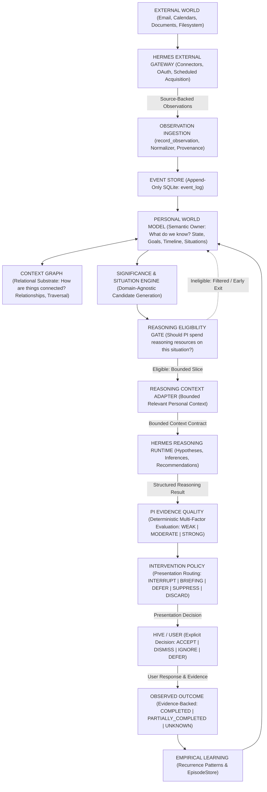

# Personal Intelligence (PI)

A local-first, privacy-preserving **Personal Intelligence system** designed as an independent personal world model, situational intelligence, and contextual reasoning layer operating with **Hermes as its external-world gateway and general reasoning runtime**.

---

## 1. Target Architecture

Personal Intelligence (PI) operates as a continuous, domain-agnostic intelligence and world model substrate. External world interactions, OAuth credentials, tool executions, and scheduled acquisitions are owned exclusively by **Hermes**. Client presentation and user interaction are owned by **Hive** (or any client application interface).

```text
EXTERNAL WORLD (Email, Calendars, Documents, Filesystem, External APIs)
      ↓
HERMES GATEWAY
  • Connectors (Gmail, Calendar, Drive, Slack, Meet, Web)
  • OAuth & Credential Lifecycle
  • External Scheduling (HermesObservationScheduler, schedules.yaml)
      ↓
SOURCE-BACKED OBSERVATIONS
  • Ingested via record_observation() boundary
  • Mandatory source provenance (source, source_id, timestamp, payload)
      ↓
PI CORE SUBSTRATE
  • Event Store: Append-only immutable SQLite store (event_log)
      ↓
  • Personal World Model: Semantic owner of state, goals, timeline, situations
      ↕ (relational query substrate)
    Context Graph: Relational connective substrate (entity_nodes, entity_edges)
      ↓
  • Change, Novelty & Significance: Baseline divergence & goal-impact scoring
      ↓
  • Situation Discovery: Domain-agnostic candidate generation (4 lifecycle states)
      ↓
  • Reasoning Eligibility Gate: Semantic question ("Should PI spend reasoning resources?")
      ↓
  • Bounded Relevant Personal Context: PI → Hermes contract (entities, events, state, timeline, goals)
      ↓
HERMES REASONING RUNTIME
  • ReasoningWorkflow & general LLM runtime
  • Pre-LLM boundary hook validation (on_pre_llm_call guards against world dumps)
      ↓
STRUCTURED REASONING
  • StructuredReasoningResult: Hermes → PI contract
  • what_is_happening, observations_used, evidence_references, inferences, predictions, recommendations
      ↓
PI EPISTEMIC & INTERVENTION AUTHORITY
  • Evidence Quality: Sole authority calculating multi-factor evaluation (WEAK | MODERATE | STRONG)
      ↓
  • Intervention Policy: Sole authority deciding presentation routing (INTERRUPT | BRIEFING | DEFER | SUPPRESS | DISCARD)
      ↓
HIVE / CLIENT APPLICATION
  • User Interface & presentation only
  • User Decisions: ACCEPT | DISMISS | IGNORE | DEFER
      ↓
OBSERVED OUTCOMES
  • Evidence-backed real-world outcomes: COMPLETED | PARTIALLY_COMPLETED | UNKNOWN
      ↓
LONGITUDINAL LEARNING
  • Empirical non-causal recurrence patterns (EpisodeStore, PatternStore)
      ↓
PERSONAL WORLD MODEL CONVERGENCE
  • Local maintenance, salience decay, WAL checkpointing (LocalMaintenanceScheduler)
```

### Dual-Path Intelligence Architecture: Interactive & Proactive

Both interactive user queries and autonomous proactive evaluations share the **exact same PI intelligence boundary**:

```text
INTERACTIVE INQUIRY PATH:
HIVE USER
    ↓
PI CLIENT API (ask / query_interactive)
    ↓
PI CONTEXT QUERY (ContextQueryEngine)
    ↓
BOUNDED PERSONAL CONTEXT (BoundedRelevantPersonalContext)
    ↓
HERMES (Structured Reasoning)
    ↓
STRUCTURED REASONING (StructuredReasoningResult)
    ↓
PI EVIDENCE QUALITY (EvidenceQualityCalculator)
    ↓
PI RESPONSE ASSEMBLY (Grounded response with evidence & uncertainty)
    ↓
HIVE

PROACTIVE SITUATIONAL PATH:
SOURCE-BACKED OBSERVATION (record_observation)
    ↓
PI WORLD MODEL (EventStore -> WorldModel ↕ ContextGraph)
    ↓
SITUATION DISCOVERY (Domain-agnostic candidates)
    ↓
REASONING ELIGIBILITY GATE (Semantic resource allocation)
    ↓
BOUNDED PERSONAL CONTEXT (BoundedRelevantPersonalContext)
    ↓
HERMES (Structured Reasoning)
    ↓
STRUCTURED REASONING (StructuredReasoningResult)
    ↓
PI EVIDENCE QUALITY (EvidenceQualityCalculator)
    ↓
PI INTERVENTION POLICY (InterventionPolicyEngine / PresentationDecision)
    ↓
HIVE
```

### Complete System Flow Diagram



---

## 2. Strict Division of Responsibilities

### Hermes Owns
- **External Connectors**: Direct integration with external platforms (Gmail, Google Calendar, Google Drive, Google Meet, Slack, Jira, web).
- **Authentication & OAuth**: Credential management, browser OAuth authorization flows, token refreshes, and encrypted token storage. Personal Intelligence never stores or requests OAuth credentials.
- **Scheduled External Observations**: Triggering external polling schedules (e.g. via `schedules.yaml` and `HermesObservationScheduler`).
- **Browser & Search**: Live web navigation, research tools, and read-only external tool invocation.
- **External Filesystem & Tool Execution**: Operating system tools, shell scripts, user/external filesystem interaction through its tool runtime, and Python tools under strict safety guardrails.
- **Reasoning Runtime**: Executing multi-turn reasoning workflows, hypothesis formulation, and recommendation generation.

### Personal Intelligence (PI) Owns
- **Generic Observation Boundary**: Ingestion of normalized, provenance-backed events via `record_observation()`.
- **Internal Storage Persistence**: Manages its own internal SQLite database persistence required for its World Model, Event Store, and intelligence state (`personal_intelligence.db`, `event_log`). PI does not directly acquire external filesystem observations outside the `record_observation()` boundary.
- **Event Store**: Immutable, append-only SQLite storage (`event_log`).
- **Timeline & State**: Point-in-time user state snapshots and chronologically indexed timelines.
- **Context Graph**: Relational graph substrate connecting entities, relationships, temporal intervals, goals, situations, and evidence (`entity_nodes`, `entity_edges`).
- **Goals & Commitments**: Active user goals, standing constraints, and deadlines across all life dimensions.
- **Change, Novelty & Significance**: Structured delta detection, baseline divergence, and goal-impact scoring.
- **Situation Discovery**: Domain-agnostic candidate generation and lifecycle management.
- **Reasoning Eligibility Gate**: Semantic resource allocation evaluating whether PI should spend reasoning resources on a situation based on personal significance, unresolved uncertainty, actionability, cross-context value, and reasoning history.
- **Context Query & Adaptation**: Querying relevant personal context and adapting it into bounded reasoning packets for Hermes (`BoundedRelevantPersonalContext`).
- **Evidence Quality Calculation**: Sole authority calculating deterministic multi-factor evidence quality (`WEAK`, `MODERATE`, `STRONG`). Communicates evidence support rather than claiming objective conclusion truth.
- **Intervention Policy Engine**: Sole authority deciding presentation routing (`INTERRUPT`, `BRIEFING`, `DEFER`, `SUPPRESS`, `DISCARD`) encapsulated cleanly behind `PresentationDecision`.
- **Episode Store & Longitudinal Learning**: Recording user interactions, storing evidence-backed outcomes, and discovering empirical non-causal patterns.
- **Local Maintenance Scheduling**: Local SQLite maintenance, salience decay, and situation expiration sweeps (`LocalMaintenanceScheduler`).

### Hive / Client Application Owns
- **User Interface & Presentation**: Rendering briefings, UI notifications, situation feeds, and timelines.
- **User Interaction Capture**: Collecting explicit user decisions (`ACCEPT`, `DISMISS`, `IGNORE`, `DEFER`) and transmitting them to PI capability endpoints.
- **Interactive Inquiries**: Forwarding user queries to PI's client-agnostic API (`ask()`, `query_interactive()`).

---

## 3. Core Architectural Invariants

1. **PI Independence**: PI maintains and queries its World Model, Timeline, and Context Graph headlessly without Hive or any UI client running.
2. **Connector Independence**: PI implements zero external OAuth, token management, or third-party API SDKs. Observations enter strictly through `record_observation()`.
3. **Filesystem Boundary**: Hermes owns external/user-world filesystem tool interaction. PI owns only its internal SQLite persistence required for its World Model and state. PI does not acquire external filesystem data outside `record_observation()`.
4. **Context Graph Relational Substrate**: Logical graph abstraction backed strictly by SQLite (`entity_nodes`, `entity_edges`). Zero external graph databases (no Neo4j, Memgraph, etc.).
5. **Domain Agnosticism**: An unseen signal domain requires **0 new agents, 0 new connectors inside PI, 0 new entity subclasses, 0 new relationship subclasses, 0 new reasoning pipelines, and 0 new databases**.
6. **Epistemic Segregation**:
   $$\text{Observation} \ne \text{Inference} \ne \text{Prediction} \ne \text{Recommendation} \ne \text{Action}$$
   Inferences can never be promoted to facts without explicit observation backing.
7. **Safety & Zero Autonomous Writes**: The system executes zero autonomous external write operations (no sending emails, modifying calendar events, or altering cloud files). Interventions decide presentation routing only.
8. **Policy Authority**: Hermes cannot bypass or decide PI policy. Critical urgency output cannot force an interruption during focus/quiet contexts or on weak/unverified evidence.
9. **Outcome Grounding**: Outcomes require observed evidence event IDs. User acceptance does not automatically mean a recommendation succeeded. Unbacked outcomes evaluate to `UNKNOWN`.
10. **Empirical Non-Causal Learning**: Discovers associations, recurrence, and timing regularities without causal claims. Historical observations remain strictly immutable.

---

## 4. Subsystem Breakdown

```text
personal_intelligence/
├── api/                  # Client-agnostic capability interface and HTTP server
├── core/
│   ├── activity/         # Activity stream tracking
│   ├── context/          # ContextQueryEngine & ReasoningContextAdapter
│   ├── episodes/         # Unified EpisodeStore and outcome recording
│   ├── events/           # EventStore, Observation model, buffer
│   ├── evidence_quality.py# Deterministic EvidenceQualityCalculator (WEAK, MODERATE, STRONG)
│   ├── goals/            # GoalStore and goal evaluation engine
│   ├── memory/           # MemoryMaintenanceJob (retention, decay, SQLite maintenance)
│   ├── novelty/          # Statistical baseline divergence analysis
│   ├── patterns/         # LearningEngine, PatternStore, recurrence discovery
│   ├── policy/           # InterventionPolicyEngine & PresentationDecision (5-action routing)
│   ├── scheduler/        # Local maintenance scheduler (local_maintenance.py)
│   ├── search/           # FTS5 lexical retrieval and hybrid search
│   ├── significance/     # PersonalSignificanceEngine
│   ├── situations/       # Domain-agnostic SituationEngine, SituationStore, EligibilityGate
│   ├── state/            # StateEngine, StateRepresentation, attention detection
│   ├── timeline/         # TimelineEngine and chronological interval queries
│   └── world/            # PersonalWorldModel, ContextGraph (graph.py), change detection
├── hermes_bridge/        # Hermes client, reasoning workflow, scheduler, capabilities
├── plugins/              # Hermes native plugin extension
└── storage/              # DatabaseManager and SQLite schema
```

### 4.1 Observation Ingestion (`core/events/`, `api/ingestion.py`)
- Generic `Observation` and `Event` models with strict validation, ISO-8601 UTC timestamps, and deterministic SHA-256 payload hashing.
- Append-only SQLite persistence in `event_log`. Zero data mutations.

### 4.2 Personal World Model vs Context Graph Distinction (`core/world/`)

```text
             PERSONAL WORLD MODEL
              semantic coordinator
                    ↕
              CONTEXT GRAPH
          relational substrate
```

| Subsystem | Core Question Answered | Primary Components | Primary API Shape | Storage Substrate |
| :--- | :--- | :--- | :--- | :--- |
| **Personal World Model** (`core/world/model.py`) | *"What do we currently know about this person's world?"* | Entities, State, Timeline, Goals, Commitments, Situations, Observations | `get_current_world()`, `get_current_state()`, `get_timeline()`, `get_goals()`, `get_situations()` | Semantic coordinator backed by SQLite stores |
| **Context Graph** (`core/world/graph.py`) | *"How are the relevant things in that world connected?"* | Extensible Relationships (Recommended: `RELATED_TO`, `INVOLVES`, `AFFECTS`, `DEPENDS_ON`, `SUPPORTS`, `CONFLICTS_WITH`, `PRECEDES`, `FOLLOWS`, `OCCURS_AT`, `PART_OF`, `DERIVED_FROM`, `EVIDENCE_FOR`, `MENTIONED_IN`), Temporal links, Evidence links, Relevance links, Contextual traversal | `get_related_entities()`, `get_neighbors()`, `get_context()`, `get_temporal_context()`, `get_supporting_evidence()`, `get_related_goals()`, `get_related_situations()` | Relational connective substrate backed strictly by SQLite (`entity_nodes`, `entity_edges`) |

### 4.3 State & Timeline Engines (`core/state/`, `core/timeline/`)
- `StateEngine`: Computes current user state snapshots (time of day, location, current activity, event density, routine deviation, goal pressure).
- `TimelineEngine`: Chronological queries (`get_last_n_minutes`, `get_today`, `get_time_range`, `get_around_event`).

### 4.4 Goals & Situations (`core/goals/`, `core/situations/`)
- `GoalStore`: Tracks active user goals, priorities, constraints, and target deadlines.
- `SituationEngine`: SituationEngine generates domain-agnostic situation candidates from changes, significance, relationships, goals, temporal patterns, and unresolved conditions. Current candidate signals (`unusual_state`, `prolonged_activity`, `schedule_conflict`, `routine_deviation`, `possible_goal_risk`, `potential_deadline_risk`) are generic implementation heuristics, not a closed situation ontology.
- **4 Canonical Lifecycle States**: `CANDIDATE`, `ACTIVE`, `DECAYING`, `INACTIVE`.

### 4.5 Reasoning Eligibility & Bounded Context (`core/situations/eligibility.py`, `core/context/`)
- `ReasoningEligibilityGate`: Semantic resource allocation answering *"Should PI spend reasoning resources on this situation?"* based on personal significance, unresolved uncertainty, actionability, cross-context synthesis, and reasoning history.
- `ContextQueryEngine`: Formulates structured, bounded [`BoundedRelevantPersonalContext`](file:///c:/Users/gopit/OneDrive/Desktop/Sreekanth/Personal%20Intelligence/personal_intelligence/core/context/models.py) independent of prompt formatting.
- `ReasoningContextAdapter`: Adapts bounded context into safe prompt representations for Hermes without leaking raw database dumps.

### 4.6 Epistemic Evidence Quality & Intervention Policy (`core/evidence_quality.py`, `core/policy/`)
- `EvidenceQualityCalculator`: Evaluates multi-factor categorical evidence quality (`WEAK`, `MODERATE`, `STRONG`) based on source independence, freshness, consistency, directness, and corroboration. Communicates evidence support rather than claiming objective conclusion truth.
- `InterventionPolicyEngine` / `PresentationDecision`: Encapsulates presentation routing decisions (`INTERRUPT`, `BRIEFING`, `DEFER`, `SUPPRESS`, `DISCARD`) based on urgency, actionability, evidence quality, personal significance, user context, and repetition history.

### 4.7 Episode Store & Longitudinal Learning (`core/episodes/`, `core/patterns/`)
- `EpisodeStore`: Single unified SQLite table (`reasoning_episodes`) tracking situation triggers, context snapshots, Hermes reasoning, recommendations, user responses, and empirical outcomes.
- `LearningEngine`: Discovers empirical recurrence patterns and interaction preferences using strictly non-causal phrasing.

### 4.8 Scheduler Architecture Separation (`hermes_bridge/scheduler.py` vs `core/scheduler/local_maintenance.py`)
- **Hermes External Observation Scheduler (`HermesObservationScheduler`)**:
  Hermes owns 100% of external-world observation acquisition (Gmail, Calendar, Drive, Slack, Web) scheduled via `schedules.yaml`. Normalizes raw connector payloads via `ConnectorNormalizer` and delivers source-backed observations through PI's `record_observation()` boundary.
- **PI Local Maintenance Scheduler (`LocalMaintenanceScheduler`)**:
  PI retains scheduling exclusively for local intelligence maintenance:
  - Memory maintenance & consolidation (`MemoryMaintenanceJob`)
  - Pattern decay & re-evaluation
  - Situation re-evaluation & expiration sweeps
  - Local database maintenance (SQLite WAL checkpoint, `PRAGMA optimize`)
  - Strictly prohibited from external API calls, Gmail queries, or OAuth actions.

### 4.9 Domain-Agnostic Extensible Entity Model (`core/world/graph.py`)
- **Open Taxonomy**: Eliminates the assumption of a permanently fixed entity taxonomy. Context Graph entity types are open and extensible without requiring domain-specific subclasses (no `HealthEntity`, `FinanceEntity`, `FitnessEntity`, etc.).
- **Minimal Semantic Core (Recommended Archetypes)**: Distinguishes a minimal semantic core of recommended canonical archetypes (`PERSON`, `ORGANIZATION`, `PLACE`, `DOCUMENT`, `PROJECT`, `GOAL`, `COMMITMENT`, `ACTIVITY`, `EVENT`, `SITUATION`, `THING`, `TOPIC`) from hard restrictions. Types such as `MEETING`, `DEVICE`, `OBSERVATION`, or `CONCEPT` do not require dedicated entity subclasses merely to be represented.
- **Robust Normalization & Validation**: `validate_and_normalize_entity_type` guarantees lowercase normalization, whitespace cleanup, safe length (1–64 characters), safe identifier characters, serialization, and SQLite persistence.

### 4.10 Domain-Agnostic Extensible Relationship Model (`core/world/graph.py`)
- **Explicitly Non-Closed Vocabulary**: Eliminates any assumption of a permanently fixed relationship ontology. Context Graph relationship types are open and extensible.
- **Recommended Generic Archetypes**: Recommends high-level semantic primitives (`RELATED_TO`, `INVOLVES`, `AFFECTS`, `DEPENDS_ON`, `SUPPORTS`, `CONFLICTS_WITH`, `PRECEDES`, `FOLLOWS`, `OCCURS_AT`, `PART_OF`, `DERIVED_FROM`, `EVIDENCE_FOR`, `MENTIONED_IN`), but never restricts the system to a closed enum.
- **Arbitrary Unseen Relationships**: Arbitrary safe relationships (e.g. `powers`, `telemetry_streamed_to`, `calibrated_with`, `cools`, `regulates`, `threatens`, `originates_from`) can be stored, queried, traversed, evaluated for temporal validity, and projected into bounded context without writing new code, classes, or database tables.
- **Validation Guarantees**: `validate_and_normalize_relationship_type` enforces non-empty strings, lowercase normalization, whitespace/hyphen translation to underscores, 1–64 character limits, and safe identifier characters (`^[a-z0-9_\-:\./]+$`).

---

## 5. Client-Agnostic Interface

Personal Intelligence exposes a clean capability interface (`personal_intelligence/api/interface.py`) that decouples the engine from any specific client UI:

```python
from personal_intelligence import PersonalIntelligenceClient

client = PersonalIntelligenceClient()

# Query world model snapshot
world = client.get_current_world()

# Ingest source-backed observation from Hermes
observation_id = client.record_observation(
    source="gmail",
    source_id="msg_987",
    observation_type="email_received",
    summary="Client contract renewal deadline approaching tomorrow",
    evidence={"sender": "alice@acme.com", "subject": "Contract Renewal"},
    provenance={"source": "gmail", "message_id": "msg_987"},
)

# Interactive Inquiry (Grounded contextual question answering)
response = client.ask("What meetings do I have with Acme Corp this week?")
# Returns: { answer, evidence, evidence_quality, uncertainty, sources, bounded_context, episode_id }

# Query active situations
situations = client.get_active_situations()

# Run evaluation cycle (Proactive situational intelligence)
result = client.run_evaluation_cycle(user_context="available")

# Record user response
client.record_user_response(episode_id="ep-456", response="ACCEPT")

# Record evidence-backed outcome
client.record_outcome(
    episode_id="ep-456",
    outcome_status="COMPLETED",
    evidence_event_ids=[observation_id],
)
```

---

## 6. Verification & Test Metrics

Personal Intelligence relies on Automated Regression Validation with an extensive test suite verifying architectural invariants and implementation behavior under tested scenarios:

```text
================= 930 passed, 6 warnings in 119.46s (0:01:59) =================
```

- **Tests Passed**: **930**
- **Tests Failed**: **0**
- **Test Modules**: **67**
- **Pass Rate under Tested Scenarios**: **100.0%**

*Note: Passing test suites demonstrate verified implementation correctness under specified test scenarios, not a formal proof of general intelligence or universal reliability.*

### Core Architectural Test Suites
- `tests/test_presentation_decision_policy.py`: Verifies `PresentationDecision` public model, 5-action presentation routing (`INTERRUPT`, `BRIEFING`, `DEFER`, `SUPPRESS`, `DISCARD`), non-bypassability by Hermes, weak evidence deferral, and quiet/focus context protection.
- `tests/test_interactive_reasoning_boundary.py`: Verifies unified intelligence boundary for interactive inquiries (`ask` / `query_interactive`), strictly bounded context construction, non-bypassable policy, and unaffected general Hermes queries.
- `tests/test_pi_hermes_boundary.py`: Demonstrates explicit PI ↔ Hermes boundary: `PI World Model` → `Context Query` → `Bounded Context` → `Hermes` → `Structured Reasoning` → `PI Evidence Quality` → `PI Intervention Policy`, pre-LLM dump guards, and verification that Hermes cannot directly trigger interruptions.
- `tests/test_reasoning_eligibility_semantic.py`: Verifies semantic reasoning resource allocation ("Should PI spend reasoning resources?") rejecting noise, duplicates, and staleness while allowing high significance, uncertainty, and cross-context situations.
- `tests/test_evidence_quality_epistemic.py`: Verifies Evidence Quality framing (WEAK, MODERATE, STRONG) and enforces that strong evidence does NOT claim objective certainty or verified fact.
- `tests/test_epistemic_integrity.py`: Verifies explicit epistemic integrity model (Observation ≠ Inference ≠ Prediction ≠ Recommendation ≠ Action) across World Model, Context Graph, and Event Store.
- `tests/test_domain_agnostic_extensible_relationships.py`: Verifies generic extensible relationship model and traversal without closed ontology restrictions.
- `tests/test_domain_agnostic_extensible_entity_types.py`: Verifies domain-agnostic extensible entity model without fixed taxonomy assumptions.
- `tests/test_world_model_context_graph_distinction.py`: Verifies architectural distinction and API shapes of Personal World Model vs Context Graph.
- `tests/test_scheduler_architecture_separation.py`: Verifies strict separation between Hermes external observation scheduling and PI local maintenance.
- `tests/test_hermes_world_gateway.py`: Verifies Hermes external gateway ownership, failure isolation, and degradation handling.
- `tests/test_context_graph_evolved.py`: Verifies generic relationship types, bidirectional adjacency, and temporal validity.
- `tests/test_context_intelligence_separated.py`: Verifies decoupling of context queries from Hermes reasoning prompts.
- `tests/test_observation_scheduling_separated.py`: Verifies headless Hermes observation scheduling and normalizer pipeline.
- `tests/test_epistemic_boundary_evidence.py`: Verifies categorical evidence evaluation and epistemic integrity rules.
- `tests/test_situation_discovery_domain_agnostic.py`: Verifies domain-agnostic situation discovery without specialized domain agents.
- `tests/test_intervention_policy_and_outcome_learning.py`: Verifies policy authority, non-bypassability, user response vs outcome segregation, and immutable observations.
- `tests/test_unseen_scenario_evaluation.py`: Unseen-Scenario Architectural Validation demonstrating multi-stream cross-domain synthesis on unfamiliar scenarios.
- `tests/test_north_star_architectural_acceptance.py`: End-to-end multi-domain architectural acceptance test.

---

## 7. Running the System

### Running All Tests
```bash
pytest
```

### Running Headless Event Server
```bash
python -m personal_intelligence.api.server
```

### Launching the Web Dashboard
```bash
python scripts/run_ui.py
# Open http://localhost:8080
```

### Executing Full Multi-Domain Scenario Demo
```bash
python scripts/demo_end_to_end.py
```
