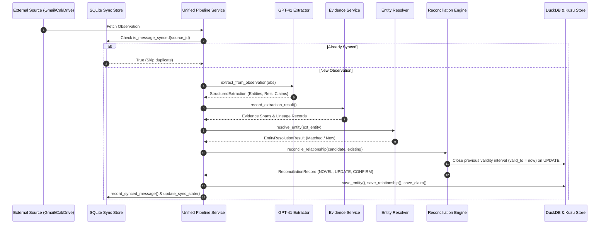

# Personal Intelligence — System Architecture & Deep Dive

This document details the architectural principles, data flow pipelines, storage schemas, reconciliation state machines, context retrieval algorithms, and privacy firewall mechanisms of the Personal Intelligence platform.

---

## 1. High-Level Architecture Overview

The system is structured as a pipeline converting raw observations across diverse data sources into a living, evidence-backed knowledge graph and providing evidence-weighted context retrieval to AI agents.

```
                  +----------------------------------------------+
                  |               DATA SOURCES                   |
                  |  Gmail | Calendar | Drive | Local Notes      |
                  +----------------------+-----------------------+
                                         |
                                         v
                  +----------------------------------------------+
                  |       UNIFIED MULTI-SOURCE INGESTION         |
                  |  Normalizer -> GPT-4.1 Extractor             |
                  +----------------------+-----------------------+
                                         |
                                         v
                  +----------------------------------------------+
                  |          EVIDENCE & RECONCILIATION           |
                  |  EntityResolver -> ReconciliationEngine      |
                  |  (Closes validity intervals on UPDATE)       |
                  +----------------------+-----------------------+
                                         |
                                         v
                  +----------------------------------------------+
                  |         DUAL PERSISTENCE STORAGE LAYER       |
                  |  DuckDB (Entities, Claims, Evidence, Log)    |
                  |  Kuzu (Nodes & Typed Edges Graph Store)      |
                  |  SQLite (Sync State & Deduplication Store)    |
                  +----------------------+-----------------------+
                                         |
                                         v
                  +----------------------------------------------+
                  |       EVIDENCE-WEIGHTED CONTEXT ENGINE       |
                  |  Seed Node -> 2-Hop Graph Traversal          |
                  |  Temporal Bounds & Exponential Recency Decay |
                  |  Composite Score & Top-K Ranking             |
                  +----------------------+-----------------------+
                                         |
                                         v
                  +----------------------------------------------+
                  |        POLICY-DRIVEN PRIVACY FIREWALL        |
                  |  PII Redaction -> Sensitive Field Stripping   |
                  |  Evidence Masking Placeholder                |
                  +----------------------+-----------------------+
                                         |
                                         v
                  +----------------------------------------------+
                  |         REASONING LAYER & FRONTEND UI        |
                  |  GPT-4.1 + Provenance Lineage Citations      |
                  |  React 19 Three.js 3D Globe Dashboard        |
                  +----------------------------------------------+
```

---

## 2. Ingestion & Multi-Source Pipeline

Observations are normalized from their source format (email bodies, calendar event JSON, document texts) into standard `Observation` objects:

- **Gmail**: `ObservationSource.GMAIL` (`message_id`, `thread_id`, `history_id`)
- **Google Calendar**: `ObservationSource.GOOGLE_CALENDAR` (`calendar_event_id`, `start_time`, `end_time`, `attendees`, `location`)
- **Google Drive**: `ObservationSource.GOOGLE_DRIVE` (`drive_file_id`, `filename`, `mime_type`, `author`, `modified_time`)
- **Local Notes**: `ObservationSource.LOCAL_FILESYSTEM` (`filename`, `modified_time`)

### Ingestion Sequence



---

## 3. Deterministic Reconciliation Engine

The `ReconciliationEngine` enforces temporal validity and lifecycle guarantees across relationships and claims.

### Reconciliation State Machine Outcomes

| Outcome | Trigger Condition | Action Taken |
|---------|-------------------|--------------|
| **`NOVEL`** | No matching relationship exists between subject and object. | Insert new relationship edge in World Model. |
| **`CONFIRM`** | Matching active relationship exists with same predicate and properties. | Increase confidence score and add supporting evidence grounding. |
| **`REFINE`** | Matching active relationship exists with complementary properties. | Merge property dictionary and update confidence score. |
| **`UPDATE`** | Active relationship exists with different state or value. | **Close previous relationship interval (`valid_to = now`)** and insert new relationship edge. |
| **`CONFLICT`** | Contradictory evidence or predicate conflict identified. | Flag relationship as contested, set `requires_user_confirmation = True`. |
| **`UNCERTAIN`** | Confidence score below threshold ($< 0.40$). | Queue item for human review in entity resolution dashboard. |

---

## 4. Context Engine Formulas & Ranking

The `ContextEngine` retrieves relevant graph subgraphs using multi-hop graph expansion, evidence weighting, temporal bounds checking, and exponential recency decay.

### Composite Relevance Score Formula

$$\text{Relevance Score} = w_{\text{text}} \times \text{TextMatch} + w_{\text{graph}} \times \text{GraphProximity} + w_{\text{evidence}} \times \text{EvidenceWeight} + w_{\text{recency}} \times \text{RecencyDecay}$$

Where:
- $w_{\text{text}} = 0.35$: Text similarity between query tokens and entity name/aliases.
- $w_{\text{graph}} = 0.35$: Graph proximity score ($1.0$ for 0-hop seeds, $0.6 \times \text{conf}$ for 1-hop neighbors, $0.3 \times \text{conf}$ for 2-hop neighbors).
- $w_{\text{evidence}} = 0.20$: Evidence weight score:
  $$\text{EvidenceWeight} = \min\left(1.0, \sum_{e \in \text{Evidence}} e.\text{confidence} + 0.20 \times \text{count}(e)\right)$$
- $w_{\text{recency}} = 0.10$: Recency decay factor:
  $$\text{RecencyDecay} = \exp(-0.02 \times \max(0, \text{days\_old}))$$

---

## 5. Policy-Driven Privacy Firewall

Before any context is serialized and exposed to external AI reasoning models, the `PrivacyFilter` executes privacy policies:

1. **Regex PII Scrubbing**:
   - Emails $\rightarrow$ `[EMAIL_REDACTED]`
   - Phone Numbers $\rightarrow$ `[PHONE_REDACTED]`
   - Social Security Numbers $\rightarrow$ `[SSN_REDACTED]`
   - Credit Card Numbers $\rightarrow$ `[CREDIT_CARD_REDACTED]`
   - API Keys & Secrets $\rightarrow$ `[SECRET_REDACTED]`
   - Compensation Figures $\rightarrow$ `[COMPENSATION_REDACTED]`
2. **Blocked Property Stripping**:
   - Removes keys in `blocked_property_keys` (e.g. `password`, `ssn`, `api_key`, `auth_token`, `private_key`).
3. **Evidence Snippet Masking**:
   - Optional setting `mask_evidence_snippets = True` replaces raw evidence text snippets with `"[EVIDENCE_SNIPPET_MASKED]"`.
